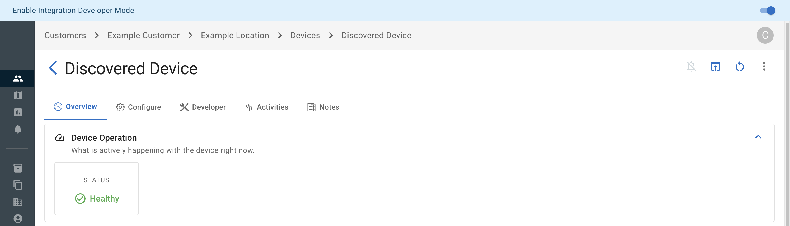

OvrC is launched in its Integration Developer Mode when
`ovrc integration serve` is executed, targeting a valid integration
build directory.

## Developer Mode Tabs

`ovrc integration serve` will open two tabs in your web browser.
Each is detailed below.

### Local Web Interface

The local developer web interface provides tools
useful for debugging integration execution.

It exposes details for each integration invocation, including:

- execution logs.
- JSON-RPC method payloads.
- JSON-RPC method results.

### OvrC Web Interface

When OvrC has been launched in Integration Developer Mode,
a persistent banner with a toggle will be shown at the top of the window.

When Integration Developer Mode is enabled, details displayed
on the "Overview" and "Configure" tabs are fetched from the local
development server.

Tools for testing an integration against specific devices can be found
on "Discovered" OvrC device pages. These developer tools live under the "Developer" tab.

Some of the tools found on the "Developer" tab include:

- a JSON-RPC tester, providing a quick and easy way to test
  specific methods an integration implements.
- a `manifest.json` tester, useful for building and testing
  a manifest file against the target device.

## Device Communication

Prior to becoming a [certified integration developer](../submission/developer-certification.md),
the machine running the development server[^1] _must_ be on the
same LAN as the target development device(s).

> [!IMPORTANT]
> This means an integration cannot be tested or developed against
> a remote device, until the user has become a certified developer
> and the device(s) have been flagged as development devices.

After becoming a certified integration developer,
all connections to a device are established via
a propriety OvrC proxy, which is how connections
are established to devices once the integration is published.
This proxy also enables remote integration testing and
development.

In order to successfully interact with the device via
the proxy, the user interacting with the device must
be a certified integration developer _and_ the device
itself must be flagged as a [development device](#development-devices).

> [!NOTE]
> This local-only development server mode is referred to as **LAN Mode**.
> Even after becoming a certified developer, **LAN Mode** can be enabled
> by providing the `--lan` option when starting the development server[^1].

### Development Devices

As stated previously, once a user has been developer certified,
all device communications are proxied through OvrC's
custom device proxy. This makes it possible to develop and test
an integration that is not on the same LAN as the development server.

To avoid misuse of this remote development capability,
development devices which will be accessed remotely (via the aforementioned proxy)
must be explicitly white-listed as development devices.

Instructions on where and how to request a device be
added to your development device list can be found on the
[developer certification](../submission/developer-certification.md) page.

[^1]: The integration development server is launched when a user executes `ovrc integration serve`.
