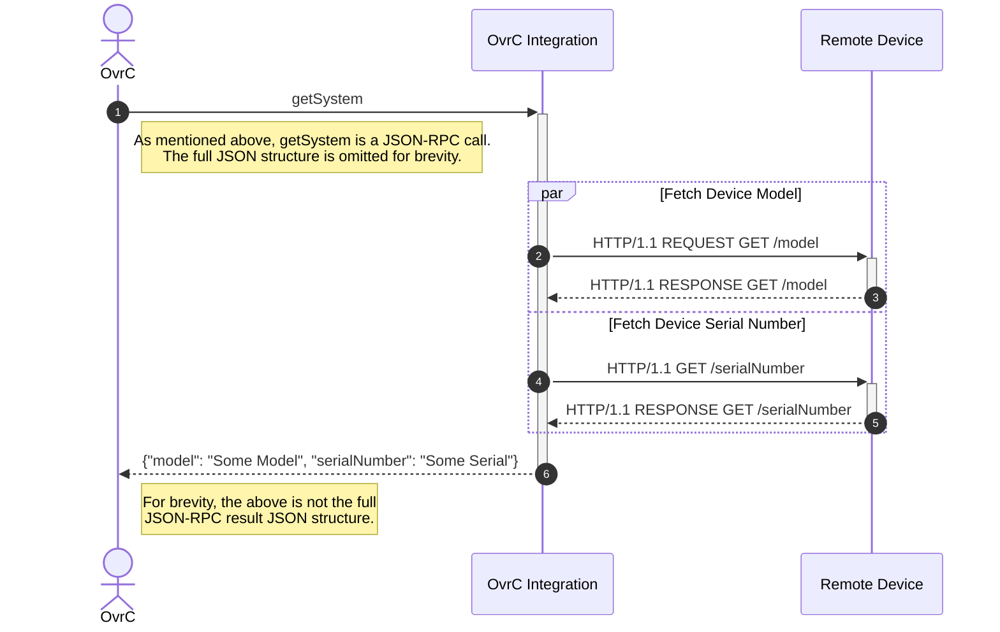

## What is an integration?

Simply put, an OvrC Integration is an isolated piece of code
serving as an adapter between OvrC and some API used to interact with the device.
This adapter layer makes it possible for OvrC to interact with devices,
and expose useful monitoring data in ways that otherwise would not be possible.

Every OvrC Integration falls into one of the following device categories:



Each of the above categories has its own unique specification,
defining what data the integration can expose, and the format of that data.

Regardless of the integration category, OvrC interfaces with an integration
using the same protocol specification: [JSON-RPC 2.0](https://www.jsonrpc.org/specification).
OvrC is agnostic to protocols or technologies the integration
uses to fetch relevant data from the device.

Here is an example of what the interaction between OvrC,
an integration, and a device might look like:

Observe that in the previous diagram, a single JSON-RPC call from OvrC to the integration
results in multiple requests being sent to the device. This is very typical for integrations.

Additionally, while the diagram above used HTTP to communicate with the device,
integrations are not constrained to HTTP, or any other protocol for that matter,
when interacting with a device.

That's the gist of an OvrC Integration!
